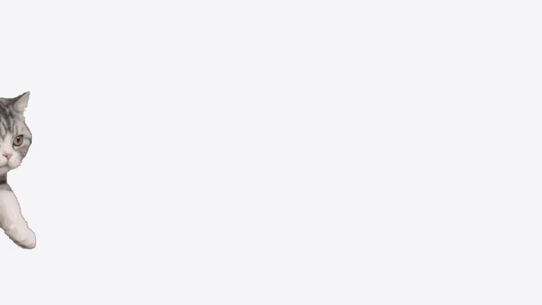
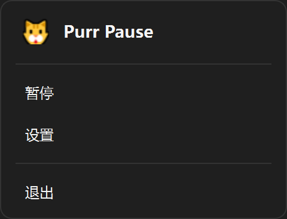
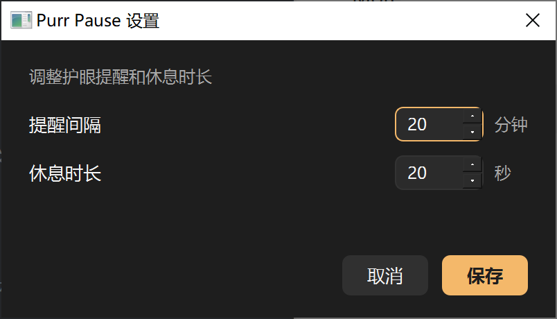
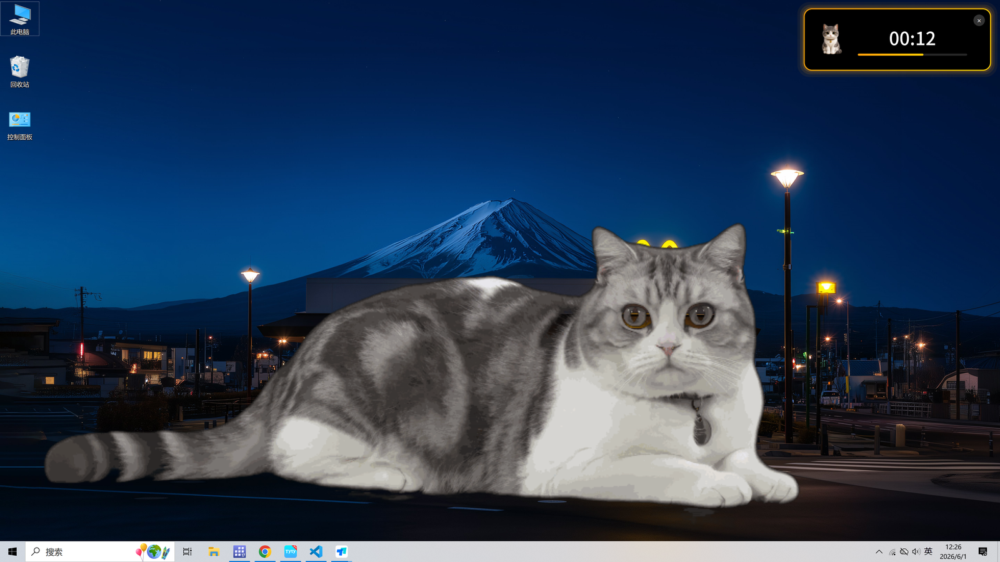
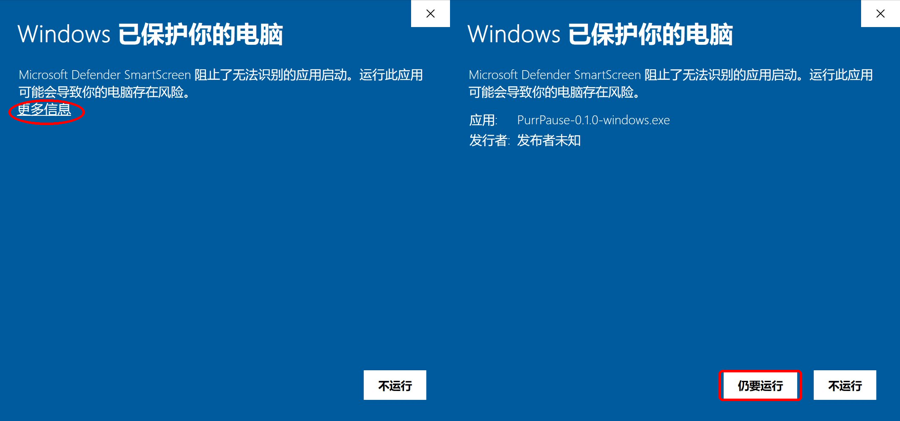

<div align="center">

# Purr Pause 🐱

**软提醒，让一只猫陪你做 20-20-20。**

[](https://github.com/David-Zhang-YB/purr-pause/releases/latest)
[](LICENSE)
[](https://github.com/David-Zhang-YB/purr-pause/releases/latest)

**[⬇ 下载 Windows 版](https://github.com/David-Zhang-YB/purr-pause/releases/latest)** · [English README](README.en.md)

</div>



---

## 为什么需要它

听说过 **20-20-20 法则** 吗？每工作 20 分钟，看向 20 英尺外的物体 20 秒，可以有效缓解眼疲劳。

但意志力靠不住——所以 Purr Pause 让一只猫每 20 分钟悄悄出现在屏幕中央，温柔地提醒你抬头。

设计理念：

- **软提醒**：猫咪不强制弹窗占满屏幕，只是温柔走过、坐一会儿、再悄然离去。
- **零打扰**：不发请求、不收集数据、不弹广告。
- **可关闭**：累了想专心？随时从托盘退出，没有"再坚持 5 分钟"的纠缠。

## 截图

| 托盘菜单 | 设置窗口 |
|---|---|
|  |  |

| 休息提醒 | 首次启动的 SmartScreen |
|---|---|
|  |  |

## 下载与安装（Windows 10 / 11）

1. 从 [Releases 页面](https://github.com/David-Zhang-YB/purr-pause/releases/latest) 下载 `PurrPause-0.1.0-windows.exe`
2. 双击运行
3. 首次启动时，Windows 会显示 **"已保护你的电脑"** 蓝色警告。这是因为本应用未购买代码签名证书——所有未签名的小型独立软件都会出现此提示。
4. 点击 **"更多信息" → "仍要运行"** 即可（详见上方 SmartScreen 截图的红圈标注）
5. 启动后应用会驻留在右下角托盘，看到 🐱 图标即表示运行成功

## macOS 支持

macOS 版本目前**暂未发布**，将在后续小版本中补充。如果你希望先在 Mac 上使用，可以从源码运行：

```bash
git clone https://github.com/David-Zhang-YB/purr-pause.git
cd purr-pause
pip install -r requirements.txt
python main.py
```

## 自定义

右键托盘 🐱 图标 → "设置"，可以调整：

- **工作间隔分钟**（默认 20）
- **休息时长秒**（默认 20）
- **猫咪图片路径**（留空使用内置动画；填写任意 GIF/PNG 的绝对路径以替换）

## 隐私与安全

Purr Pause 是一个老老实实的本地工具。我们扫描了完整的运行时源码，可以负责任地保证：

- **不联网**：v0.1.x 启动后零网络请求——无遥测、无更新检查、无崩溃上报。可以全程拔网使用，行为完全一致。
- **不动注册表**：运行时代码完全没有注册表读写调用。
- **不开机自启**：每次需要你主动启动；卸载就是直接删除 .exe。
- **不删任何文件**：运行时从不调用 `os.remove` / `shutil.rmtree` 一类的文件删除接口。
- **只写一处**：所有用户配置保存在 `%APPDATA%\PurrPause\config.json` —— Windows 标准的每用户配置目录，所有规范的应用都用这里。

完整源码可在 [GitHub 仓库](https://github.com/David-Zhang-YB/purr-pause) 审计；如果你愿意，把 .exe 拖进 [VirusTotal](https://www.virustotal.com) 扫一下也行。

v0.2 计划加入"启动时检查 GitHub Releases 是否有新版"，届时会在设置面板提供开关，并明示请求目标域名 `api.github.com`。

## 反馈

- Bug 报告 / 功能建议：[GitHub Issues](https://github.com/David-Zhang-YB/purr-pause/issues)
- 邮箱：yubo.david.zhang@gmail.com

欢迎任何形式的反馈。

## 开发

```bash
git clone https://github.com/David-Zhang-YB/purr-pause.git
cd purr-pause
pip install -r requirements.txt
pytest -v          # 跑单元测试（应全绿）
python main.py     # 启动开发版
```

打包发布：

```bash
python scripts/build_dist.py
# → dist/PurrPause-{VERSION}-windows.exe
```

## 路线图

- ✅ **v0.1.0** — 首次公开发布（Windows 单文件 .exe）
- ⏳ **v0.1.x** — 补充 macOS .dmg
- ⏳ **v0.2** — 应用内更新提醒（启动时检查 GitHub Releases）
- 🤔 后续 — 开机自启、声音通知、休息时段统计

详细变更见 [CHANGELOG.md](CHANGELOG.md)。

## 致谢

- 猫咪原始视频：[SeedDance 2.0](https://www.byteplus.com/seedance) 生成
- 中文字体：[Noto Sans SC](https://fonts.google.com/noto/specimen/Noto+Sans+SC)（SIL OFL 1.1）

完整资源出处见 [ASSETS.md](ASSETS.md)。

## License

[MIT](LICENSE) © 2026 Yubo Zhang
